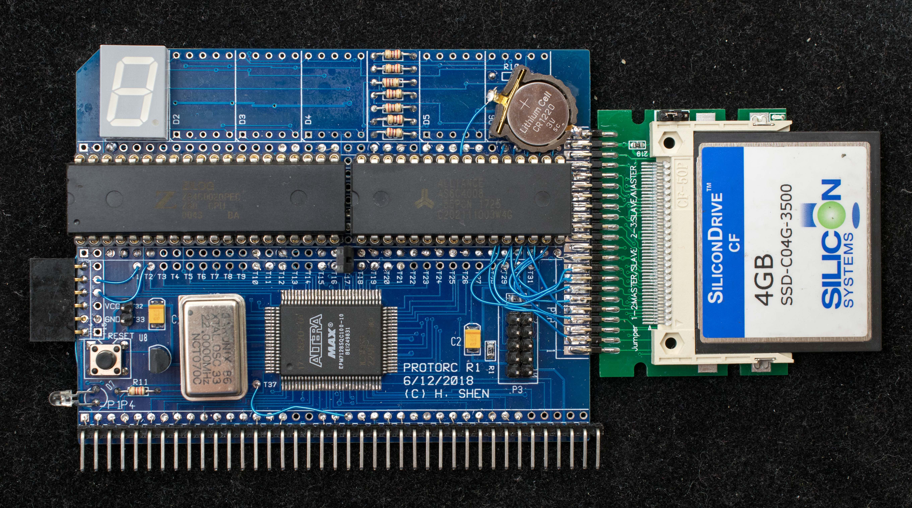

# Z80SBCRC Single board 20MHz Z80 for RC2014
## Introduction
The original intent of Z80SBCRC is to design a very simple single-board Z80 computer to check out the handful of 20MHz Z80 chips I purchased off eBay.  The design built on a Prototype for RC2014 board (https://github.com/Plasmode/ProtoRC) and added Z80 and SRAM and later a compact flash drive.  All the logic are inside the existing EPM7128 CPLD on the prototype board.

[Solder side](DSC_40231029.jpg) picture of Z80SBCRC prototype.

## Features
* 20MHz Z80 running at 22MHz
* 512Kbyte SRAM
* Compact flash interface
* CP/M ready
* CPLD glue logic
* 16K banked memory
* Serial bootstrap
* Battery-backed memory
* RC2014 bus compatible
## Theory of Operation
Z80SBCRC is a simple ROMless design with a 512K battery-backed RAM for memory.  All the glue logic are contained in Altera EPM7128 CPLD.  It has a compact flash interface for disk-based operating system such as CP/M.  Oscillator, voltage supervisor, reset button, LED, serial port connector, RC2014 connector and CPLD programming header make it a standalone single-board computer.

The RAM is divided into 32 16Kbyte pages such that any 4 pages can be accessed by Z80 at any given moment.  The top 16K of Z80 memory always maps to the same 16Kbyte page (page 31) which is the common memory.  At the initial power up,  page 0, 1, 2 and 31 are mapped to memory 0x0-0x3FFF, 0x4000-0x7FFF, 0x8000-0xBFFF, and 0xC000-0xFFFF, respectively.  

Since there is no ROM on board, there needs to be a way of loading program in RAM initially.  This is accomplished by putting the board in the "serial bootstrap" mode via a jumper selection.  In this mode, Z80 bus is tristated immediately after reset, the serial port waits for incoming 255 data at 115200,N,8,1 and place the data in RAM starting from location 0x0 to 0xFF.  When the 255th byte of serial data is received, the bus mastership is relinquished back to Z80 and it begins program execution at 0x0, just like a normal power-on reset.  Once program is loaded, the mode jumper can be changed to "RAM bootstrap" mode where the Z80 will boot from location 0x0 of RAM normally.

## Design Data
* [ProtoRC rev1 schematic](https://github.com/Plasmode/ProtoRC/blob/master/protoRC_r1_scm.pdf).  This is the base on which Z80SBCRC is built on.
  - [Wiring list](Z80SBCRC_wiring_list.md) of Z80SBCRC
* Memory map of Z80SBCRC
* [CPLD equations](working_CF_22M_16kbank.zip) of Altera EPM7128SQC100
### Software for Z80SBCRC
* [Serial bootstrap](Z80SBCLD.BIN), this 255-byte program is serially loaded into lowest part of RAM.  Execution starts from 0x0 after the 255th byte is loaded.  Here is the [source](Z80SBCLoad.asm)
* [ZMon](Zmon.asm), simple monitor for Z80SBCRC.  Here is the [source](Zmon.asm)
* [SCMonitor](SCM_startrek.hex), a sophiscated monitor by [Steve Cousins](http://scc.me.uk/) ported to Z80SBCRC.  Note, this version of SCMonitor has the StarTrek BASIC program loaded.  To run StarTrek in BASIC, type 'WBASIC', then 'RUN'.
* [cpm22all](cpm22all.hex), CP/M22 for Z80SBCRC.  Here is the [source](CPM22all.asm)
* xmodem, this is first loaded into memory as Intel HEX file, then boot up CP/M and type 'SAVE 17 XMODEM.COM' to create the first file in CP/M22 disk
* CPM22DISTRO, this is the distribution files for CP/M2.2.  It is packaged as .pkg file.  It needs depkg.com (below) to unpackage into CP/M2.2 system files
* depkg.com, this file unpackage the CPM22DISTRO above.
## Construction log
[Sequence of photos](construction_log/readme.md) of Z80SBCRC being constructed.

