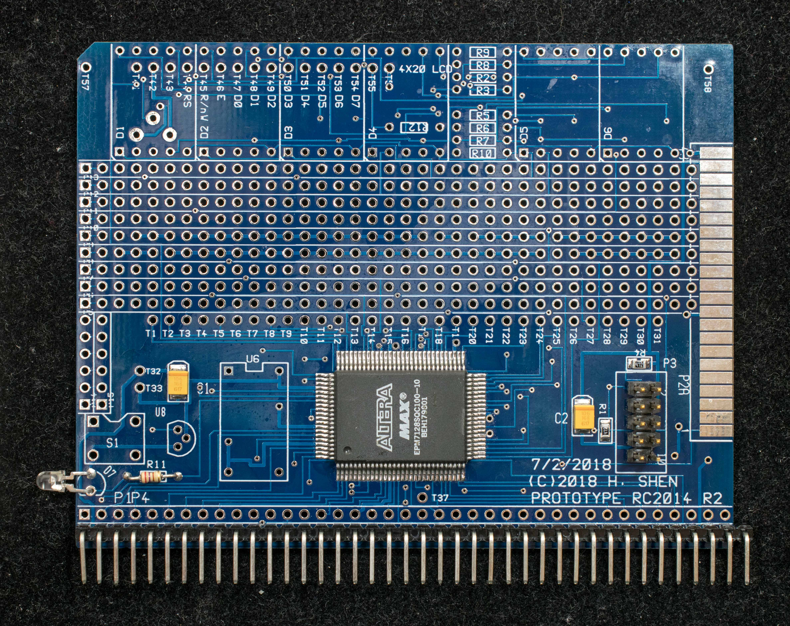
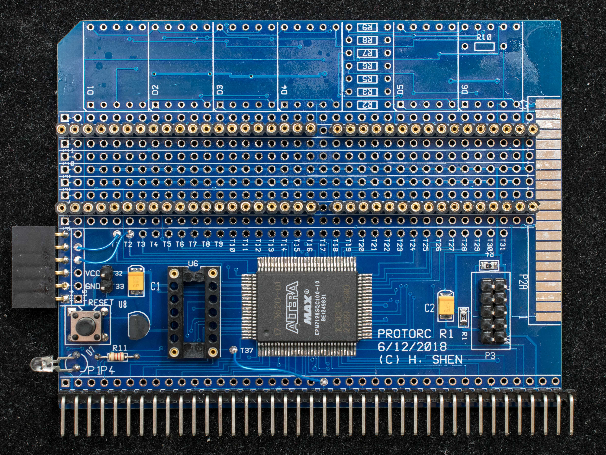
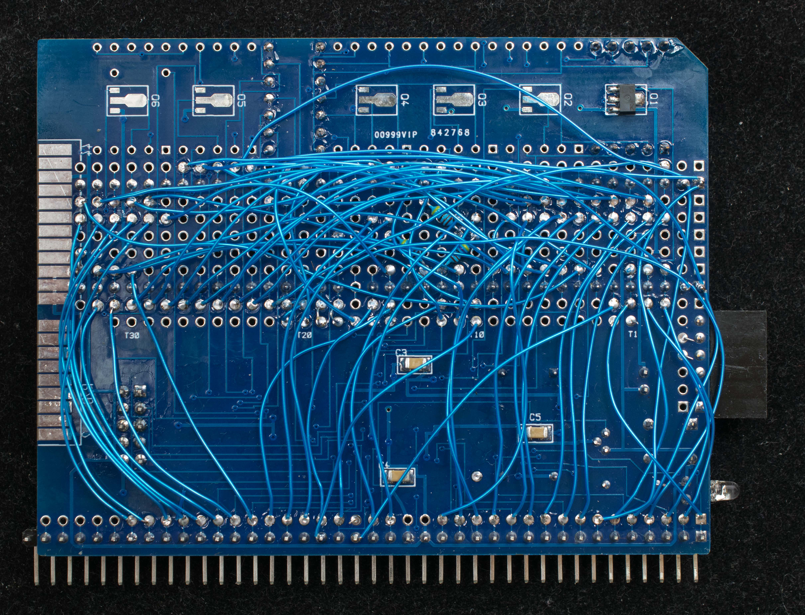
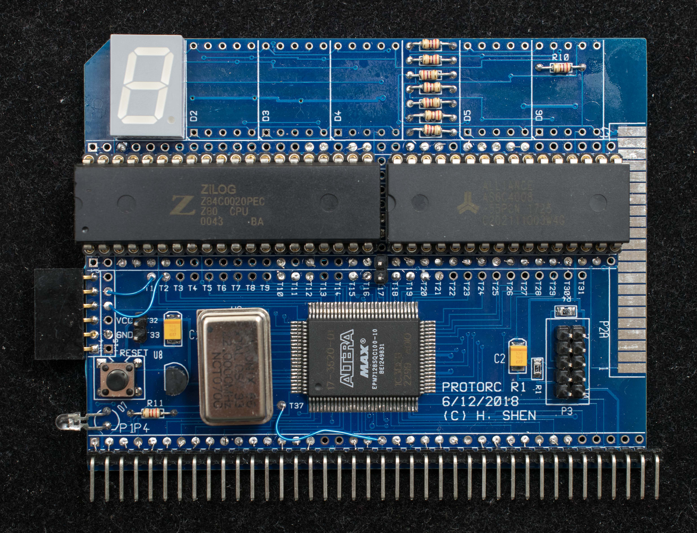
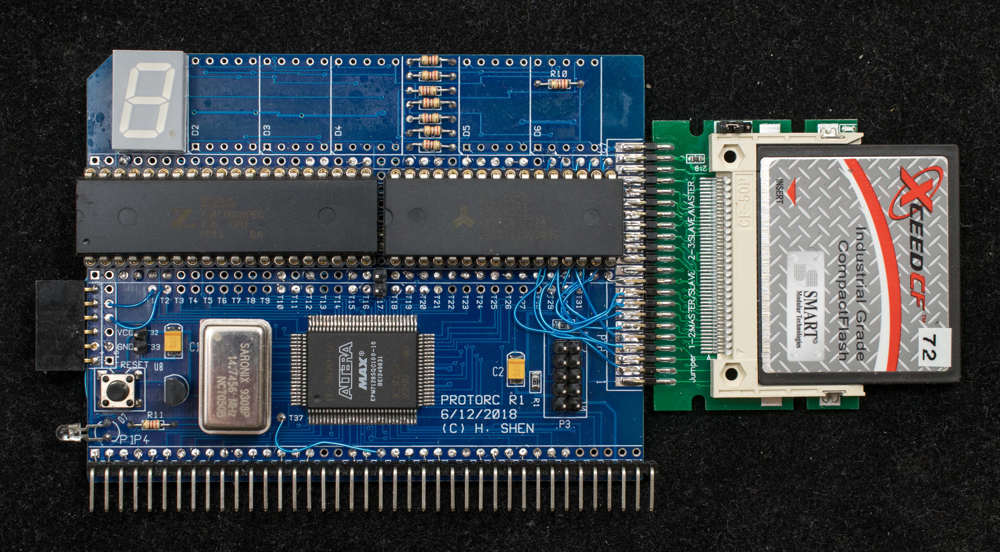
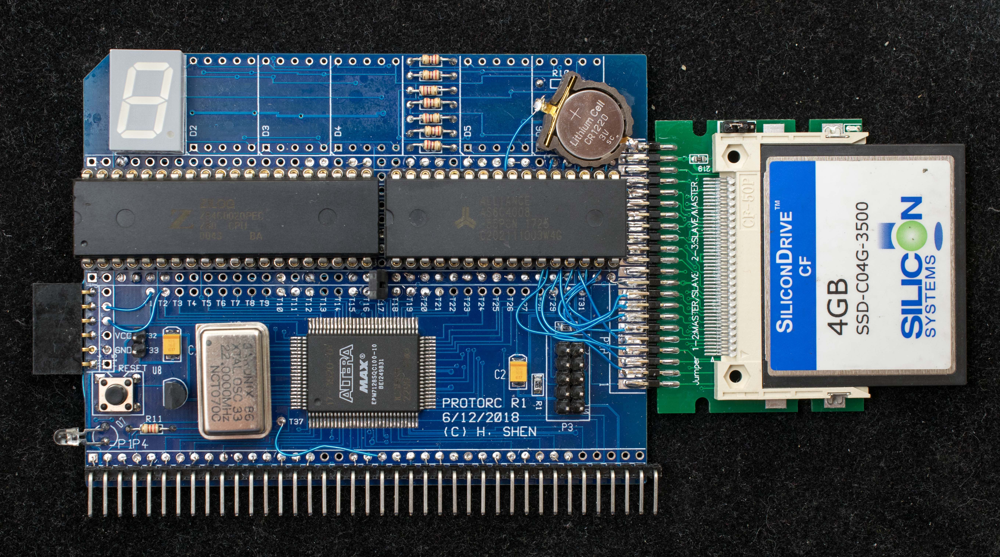

# Construction photos of Z80SBCRC prototype.
### start with populated [ProtoRC rev1](https://github.com/Plasmode/ProtoRC)

solder side of [ProtoRC rev1](DSC_40091024.jpg)

### Add sockets for Z80, RAM, oscillator, support circuits

[solder side](DSC_40111024.jpg)

### Wire in the [connections](../Z80SBCRC_wiring_list.md)

[component side](DSC_40141024.jpg)

### Populate Z80, RAM, oscillator and test!

### Add CF adapter

[solder side](DSC_40191027.jpg)

### Add battery backup for RAM

[solder side](DSC_40231029.jpg)
